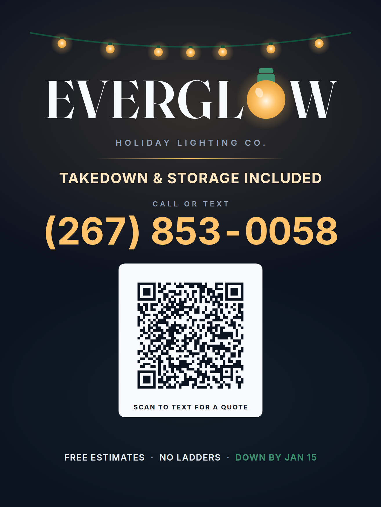

# Everglow Holiday Lighting Co.

Brand identity, marketing website, and full business plan for a Christmas light
**installation and removal** company.

The strategic idea in one line: **everyone sells the install — we sell the January takedown
and the free storage**, which is what customers actually worry about and what makes them
renew every year without being sold to again.

---

## ⚠ Before you launch — the must-change list

The site is complete and functional, but it ships with **placeholder business details**.
Find-and-replace these across `index.html` and `quote.html`:

| Placeholder | Replace with | Where |
| --- | --- | --- |
| ~~`(555) 555-0142`~~ | ✅ Done — set to `(267) 853-0058` across both pages and `quote.js` | — |
| `hello@everglowlighting.com` | Your real email | Both pages, `quote.js` |
| `everglowlighting.com` | Your real domain | Both pages (canonical, OG tags, JSON-LD). The yard sign no longer prints it — see `docs/YARD_SIGN.md`. |
| Chestnut Hill, Blue Bell, Ambler, Flourtown, Lafayette Hill, Plymouth Meeting, Glenside, Dresher, Fort Washington, Wyndmoor, Horsham, Erdenheim | **Your** service area | `index.html` — service-area chips, the map SVG labels, and `areaServed` in the JSON-LD |
| The 15-mile service radius | Your real radius, if different | `index.html` — service-area heading and the map label |

Two things are **deliberately not fabricated**, and you must not fake them:

1. **The three testimonials** in `index.html` are marked `SAMPLE` in the markup and read
   "Sample review" on the page. Replace them with real, verbatim customer reviews, or
   delete the whole `#reviews` section until you have some.
2. **There is no `aggregateRating` in the structured data.** Publishing an invented star
   rating violates Google's structured-data policy and can get your rich results
   suppressed. Add it only once you have real reviews to count.

Also confirm before going live: you actually carry the **$2M general liability and workers'
comp** the site advertises, and you can genuinely honor the **24-hour fix** and the
**January 15 takedown**. Those three claims are the entire brand — the site is built to sell
them, so they have to be true.

---

## The yard sign

An 18×24 double-sided coroplast sign is ready to print at
`assets/print/yard-sign.pdf`, with the phone number set large enough to read from
the street and a QR that **needs no website**: scanning it opens the passer-by's
messaging app with a quote request already typed, addressed to (267) 853-0058.

`docs/YARD_SIGN.md` covers the full printer spec, testing the QR before you order
a stack, switching it to a website link once the domain is live, and where signs
may legally be placed.



---

## What's in here

```
├── index.html              Homepage — hero, process, services, gallery,
│                           reviews, service area, FAQ, CTA
├── quote.html              4-step quote request form (the conversion page)
├── assets/
│   ├── css/styles.css      Design system + all homepage components
│   ├── css/quote.css       Quote form styles
│   ├── js/main.js          Nav, sticky header, scroll reveal, FAQ accordion
│   ├── js/quote.js         Step logic, validation, live estimate, submission
│   ├── img/                logo.svg, logo-mark.svg, favicon.svg
│   └── print/              18×24 yard sign — HTML master, print PDF, QR, proofs
├── tools/
│   ├── make_qr.py          Generates the sign QR for a given URL
│   ├── embed_fonts.py      Subsets and inlines Fraunces + Inter into the master
│   └── build_signs.py      Renders the print PDF and the proofs
└── docs/
    ├── BRAND_GUIDE.md      Name rationale, positioning, voice, color, type,
    │                       logo rules, photography, physical touchpoints
    ├── BUSINESS_PLAN.md    Offer, market, pricing, unit economics, 3-season
    │                       projection, startup capital, ops calendar, risks
    ├── LEAD_GENERATION.md  Ranked channel playbook, ad budgets, commercial
    │                       outreach, follow-up scripts, renewal campaign
    └── YARD_SIGN.md        Sign design rationale, print spec, QR setup, placement
```

The website has no build step, no dependencies, no framework. Open `index.html` and it runs.
The print files under `assets/print/` are already rendered; you only need Python if you
want to change the sign or repoint its QR.

---

## Running it locally

```bash
python3 -m http.server 8000
# then open http://localhost:8000
```

## Deploying

It's a static site, so anything works — Netlify, Vercel, Cloudflare Pages, or GitHub Pages.
Drag the folder into Netlify and you're live. Point your domain at it and add SSL (free
everywhere). Total hosting cost should be $0.

---

## Wiring up the quote form

**The form is in DEMO MODE right now.** It validates and shows the success screen, but
nothing is actually sent anywhere, and the success screen says so.

Open `assets/js/quote.js` and set the endpoint at the top:

```js
var CONFIG = {
  endpoint: 'https://formspree.io/f/YOUR_ID',   // ← your form endpoint
  fallbackEmail: 'you@yourdomain.com',
  phone: '(267) 853-0058'
};
```

Options, easiest first:

| Service | Setup |
| --- | --- |
| **Formspree** | Free tier, 60s setup. Create a form, paste the URL above. |
| **Netlify Forms** | Add `netlify` and `name="quote"` to the `<form>` tag; Netlify captures it automatically. |
| **Zapier / Make webhook** | Paste the catch-hook URL. Lets you push straight into Jobber, Housecall Pro, a Google Sheet, and an SMS alert at once. |
| **Your CRM directly** | Jobber and Housecall Pro both accept inbound webhooks. |

The form posts JSON with every answer plus `estimateShown`, `submittedAt`, and `source`.

**Set up an SMS alert on new submissions.** The business plan's single most important
metric is a **response within 15 minutes** — the first company to reply wins about half
the time. An email you check at night will not do that.

### Form features worth knowing about

- **4 steps** with a progress bar; validation blocks you from advancing past an incomplete step.
- **Live ballpark estimate** in the sidebar, updating as answers change. Commercial always
  returns "Custom quote."
- **Package deep links** — `quote.html?package=roofline|signature|estate` pre-checks that
  package's scope items. The homepage no longer publishes prices, but these links still work
  from an ad, an email, or a QR code.
- **Honeypot field** catches spam bots without a CAPTCHA.
- **Failure fallback** — if the POST fails, the lead is never lost: the page shows your
  phone number and a pre-filled mailto containing all their answers.

### Tuning the estimate

The ranges come from `STORY_MULT` and the `data-price` attributes on the scope checkboxes in
`quote.html`. **Recalibrate these after your first ten real quotes** so the number people see
matches what you actually charge. A ballpark that reads low and then jumps at quote time
costs you the job.

Note that the homepage does not publish prices — this sidebar estimate on the quote page is
the only number a customer sees before you send a real quote. If you'd rather show no number
at all, delete the `.qsummary` block from `quote.html`.

---

## Design system quick reference

| Token | Value | Use |
| --- | --- | --- |
| Midnight | `#0B1220` | Primary background |
| Bulb | `#FFC46B` | The glow — one call to action per screen |
| Pine | `#14513C` | Evergreen support, form accents |
| Cranberry | `#C2413C` | Errors and urgency only, sparingly |
| Snow | `#F7F9FC` | Light sections — pricing, FAQ, forms |
| Display type | Fraunces 600 | Headlines |
| Body type | Inter 400/500/600 | Everything else |

The site is dark-first on purpose: dark ground sells the glow, light sections sell trust
(pricing, FAQ, the form). Full rationale in `docs/BRAND_GUIDE.md`.

**Illustrations, not photos.** Every visual is hand-built inline SVG — the hero house, the
five gallery scenes, the service-area map. That's deliberate: stock photos of Christmas
lights look fake and undercut the trust argument. **Replace the five gallery SVGs with real
blue-hour photos of your own work as soon as you have them** — that's the highest-converting
asset you will ever own. Shoot the ~25 minutes after sunset, never full dark.

---

## Where to start (first 30 days)

1. Read `docs/BUSINESS_PLAN.md` §4 (pricing) and §5 (unit economics). Those two sections
   decide whether you make money — the plan still carries the full pricing model even though
   the website no longer publishes it.
2. Check the name against USPTO and your state registry, then buy the domain and handles
   (`docs/BRAND_GUIDE.md` §1 has the checklist and five backup names).
3. Get insured. Everything else on this site is a lie without it.
4. Claim and fill out your Google Business Profile — for local service searches it outranks
   this website (`docs/LEAD_GENERATION.md` §1).
5. Wire up the form endpoint and the SMS alert.
6. Buy light inventory in **June or July**, before the seasonal markup.
7. Start commercial outreach in **July**; it books before residential and funds the
   inventory buy.

Accessibility and browser support: semantic HTML, keyboard-navigable, visible focus rings,
`prefers-reduced-motion` respected, no horizontal scroll down to 320px. Works in all current
browsers with graceful degradation (scroll reveals fall back to always-visible).
